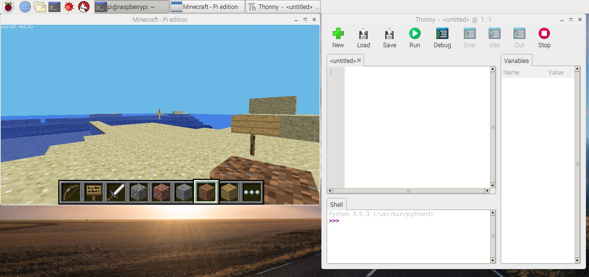
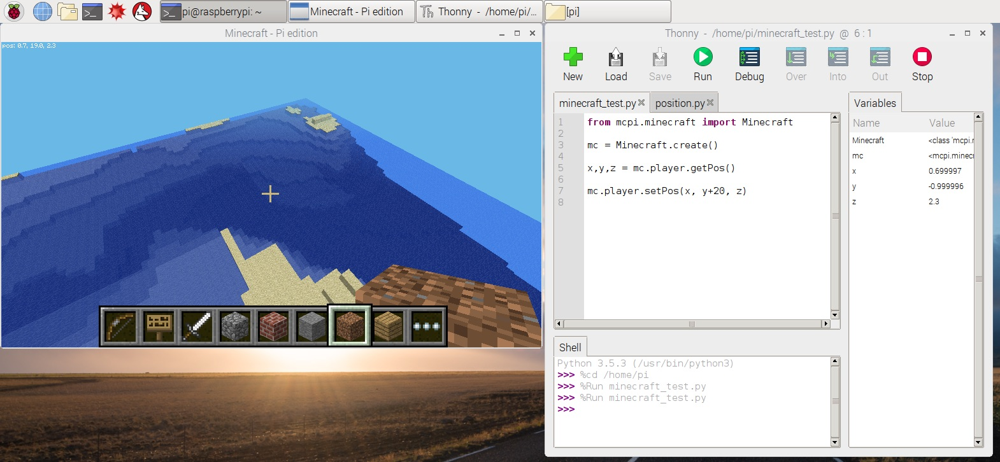
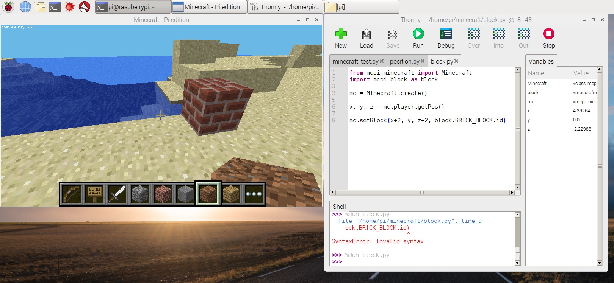
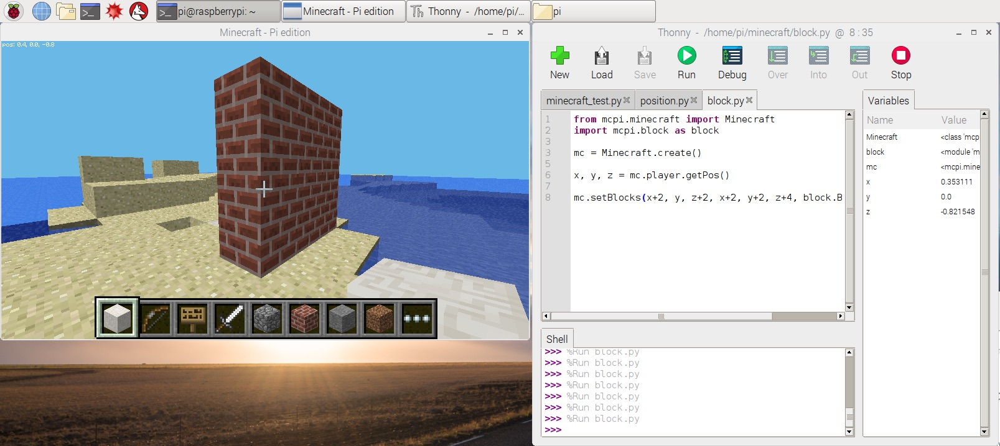
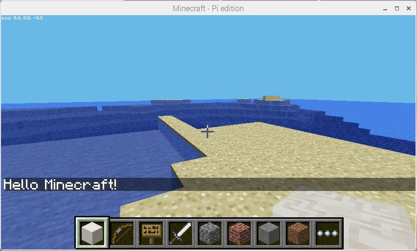
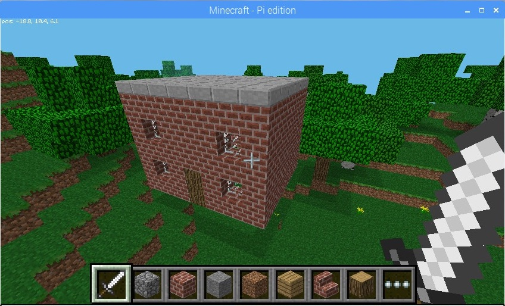
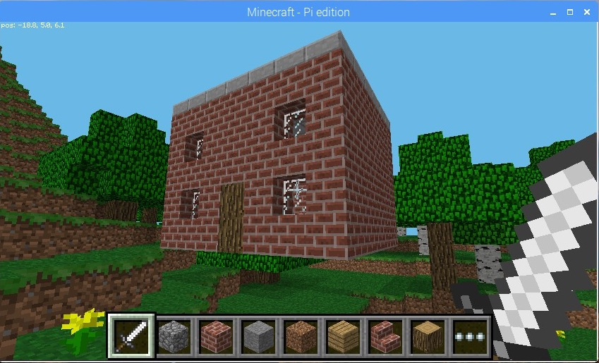
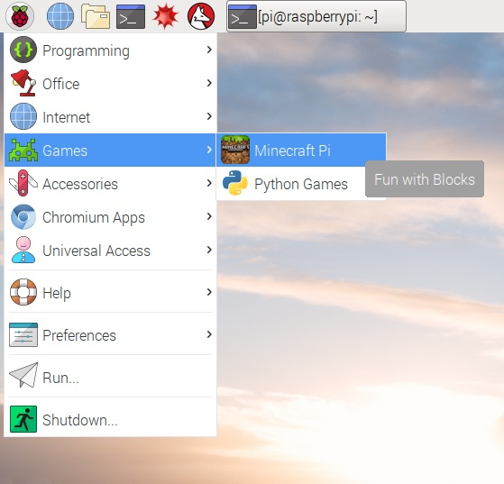
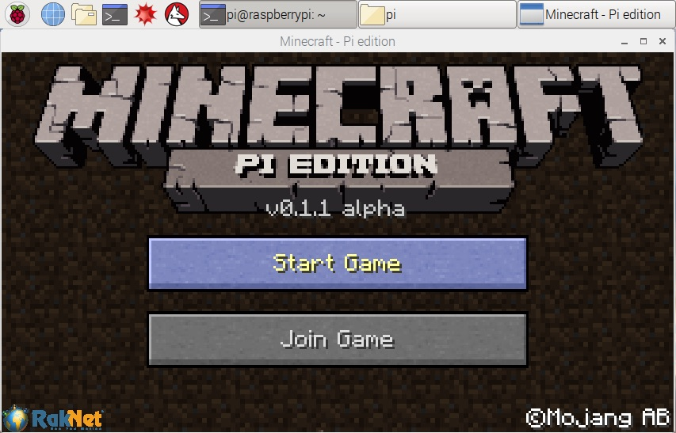

# Introduction

A brief guide on how to set up Minecraft Pi and use Python to control the game. If you need help figuring out the controls, see the  _Getting Started_ section at the end of this page.


# Setting Up Your Editor

You can edit the Python code using any text editor you like, however I would recommend using the _Thonny (Simple Mode)_ editor which is pre-installed (and can be found in the menu under _Programming_). If you have a big enough screen then I would recommend placing the editor alongside Minecraft Pi so you don't have to keep switching windows.




The following shows how to perform common tasks using using the Minecraft API. For a comprehensive list of functions, see [this page](http://www.stuffaboutcode.com/p/minecraft-api-reference.html).

## Example 1: Moving The Player

Enter the following into your editor.

```python
from mcpi.minecraft import Minecraft

mc = Minecraft.create()

# Get the x, y and z positions of the player
x,y,z = mc.player.getPos()

# Increase the y position so the player is taken off the ground.
mc.player.setPos(x, y+20, z)
```

Save the file and call it `minecraft.py`.  Now press _Run_ to execiute the code. 

The player should now be high up above the ground. Hold the _shift_ key to go back to the ground!



## Example 2: Placing Blocks

Let's place a block next to our player (you may need to move around to see it).

```python
from mcpi.minecraft import Minecraft
import mcpi.block as block

mc = Minecraft.create()

# Get the x, y and z positions of the player
x,y,z = mc.player.getPos()

# Place a block near the player (at the same height).
mc.setBlock(x+2, y, z+2, block.BRICK_BLOCK.id)

```



Placing lots individual blocks can get a bit tedious. Luckily, there's a `setBlocks` function which allows you place multiple at the same time. Replace the `setBlock` code with the following:

```python
mc.setBlocks(x+2, y, z+2, x+2, y+2, z+4, block.BRICK_BLOCK.id)
```



The `setBlocks` method takes two positions and fills in the space in between. So, in our example, we increased the Z coordinate (so the wall was wider) and increased the the Y coordinate so the wall was taller.

Of course, it's possible to use other types of bricks, just change the ID in your code to one of the following:

| ID                | 
|-------------------|
|AIR                |
|STONE              |
|GRASS              |
|DIRT               |
|COBBLESTONE        |
|WOOD_PLANKS        |
|SAPLING            |
|BEDROCK            |
|WATER_FLOWING      |
|WATER              |
|WATER_STATIONARY   |
|LAVA_FLOWING       |
|LAVA               |
|LAVA_STATIONARY    |
|SAND               |
|GRAVEL             |
|GOLD_ORE           |
|IRON_ORE           |
|COAL_ORE           |
|WOOD               |
|LEAVES             |
|GLASS              |
|LAPIS_LAZULI_ORE   |
|LAPIS_LAZULI_BLOCK |
|SANDSTONE          |
|BED                |
|COBWEB             |
|GRASS_TALL         |
|WOOL               |
|FLOWER_YELLOW      |
|FLOWER_CYAN        |
|MUSHROOM_BROWN     |
|MUSHROOM_RED       |
|GOLD_BLOCK         |
|IRON_BLOCK         |
|STONE_SLAB_DOUBLE  |
|STONE_SLAB         |
|BRICK_BLOCK        |
|TNT                |
|BOOKSHELF          |
|MOSS_STONE         |
|OBSIDIAN           |
|TORCH              |
|FIRE               |
|STAIRS_WOOD        |
|CHEST              |
|DIAMOND_ORE        |
|DIAMOND_BLOCK      |
|CRAFTING_TABLE     |
|FARMLAND           |
|FURNACE_INACTIVE   |
|FURNACE_ACTIVE     |
|DOOR_WOOD          |
|LADDER             |
|STAIRS_COBBLESTONE |
|DOOR_IRON          |
|REDSTONE_ORE       |
|SNOW               |
|ICE                |
|SNOW_BLOCK         |
|CACTUS             |
|CLAY               |
|SUGAR_CANE         |
|FENCE              |
|GLOWSTONE_BLOCK    |
|BEDROCK_INVISIBLE  |
|STONE_BRICK        |
|GLASS_PANE         |
|MELON              |
|FENCE_GATE         |
|GLOWING_OBSIDIAN   |
|NETHER_REACTOR_CORE|

## Example 3: Sending a Chat Message

Use the `postToChat` function to display a message to all players.

```python
from mcpi.minecraft import Minecraft
mc = Minecraft.create()
mc.postToChat("Hello Minecraft")
``` 




## Example 4: Building a House

To see a more complicated example, which builds a basic house using various different types of blocks see the `house.py` file in the _examples_ directory.





----

# Getting Started

## Pre-requisites

You'll need a Raspberry Pi which has Minecraft Pi pre-installed. Ideally, your Pi should be [up-to-date](https://www.raspberrypi.org/documentation/raspbian/updating.md) and have the latest software installed.

Open the _MineCraft Pi_ program (under _Games_) and start a game. Alternatively, you can join an existing game which is running on another Raspberry Pi on your local network.





## Controls

### Keyboard

|               | Key           | Description                                               |
| ------------- | ------------- | ----------------------------------------------------------|   
| *General*     | Esc           | Open menu                                                 |
|               | Tab           | Free mouse (so it can be used outside of Minecraft)       |
|               | 1-8           | Select a block                                            |
|               | w/a/s/d       | Move forward/left/back/right                              |
|               | e             | Open inventory                                            |
|               | shift         | Crouch                                                    |
|               | space         | Jump                                                      |
| *Flying*      | space         | Ascend (when flying)<br>_Double tab_: fly/stop flying     |
|               | shift         | Descend (when flying)                                     |

### Mouse

| Key           | Description                                                                                                              |
| ------------- | -------------------------------------------------------------------------------------------------------------------------| 
| Left button   | Smash block                                                                                                              |
| Right button  | Place block _(use sword, raise bow, although [not possible](https://minecraft.gamepedia.com/Pi_Edition) to fire)_        |
| Wheel         | Select a block                                                                                                           |
| Move mouse    | Move camera                                                                                                              |

(Note: the above is based on [this cheat sheet](https://arghbox.wordpress.com/2013/07/28/minecraft-pi-controls/)).

