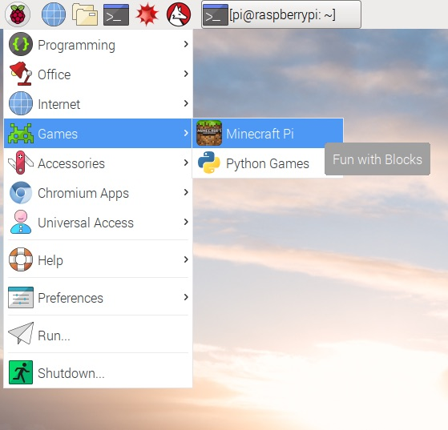
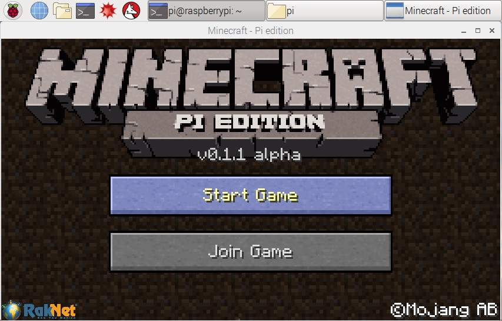

# City Planner

## Objectives

* Set up a shared Minecraft world over a network. 
* Create a small town, with each person creating a different building.
* Connect each of the buildings with roads and/or paths.

## Setup

1. Connect your Raspberry PIs to the network. An internet connection isn't required but the computers should be able to communicate with each other over the local network.
1. Open Minecraft Pi on all of your computers.

1. On one Raspberry Pi, select *Start Game*. This computer will act as the server and will host the shared Minecraft world. 

1. On all of the other computers, select *Join Game*. You should see the server which you set up. If you don't see any games in the list, make sure the computers have a network connection and are connected to the same local area network.

## Challenge

Create a small town which has buildings, houses and parks which are connected to each other with roads and/or paths. Each person in the group can build their own building. I've listed some ideas below but feel free to build something else if you would prefer.

### Houses

Create a house for a family to live in. If you have time, create a street with several houses. Each house should have:

* A front door
* Some windows
* A chimney
* A roof
* A garden 

### Sports Stadium

Create a sports stadium for your town. It can be for football, rugby, cricket, ice hockey or another sport which you like. It should include:

* An entrance.
* A place for players to play the sport, e.g. a field.
* An area for spectator to watch.

You could also consider adding advertising and a score board.

### Park

Create a place where people can relax and play sports. The park should have:

* A field where people can play sports.
* An area where children can play, e.g. perhaps you could build a climbing frame.
* A small shop where people can buy snacks.

### Shop

Create a place where people can buy food. 

### Police & Fire Station 

Create a police station and/or a fire station. 

* Create the building.
* Add some vehicles.

### School

Create a school. Perhaps you could create a Minecraft version of your school. It should have:

* The school building.
* A playing field.

